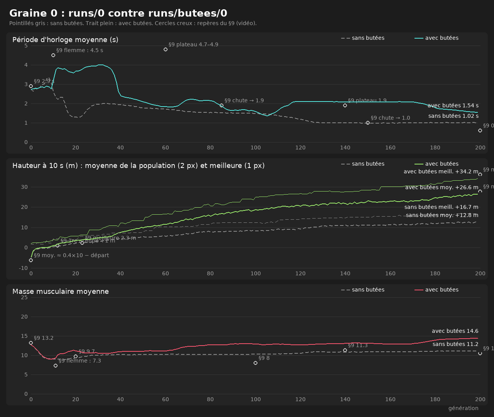
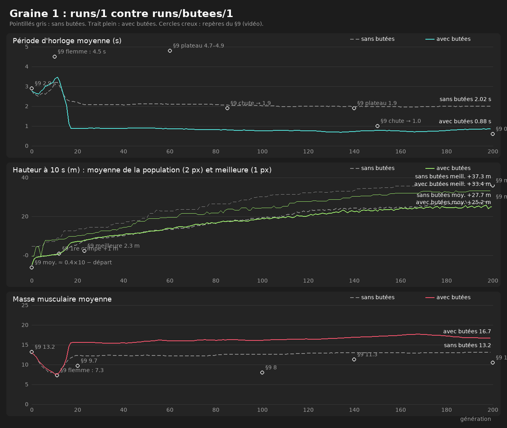
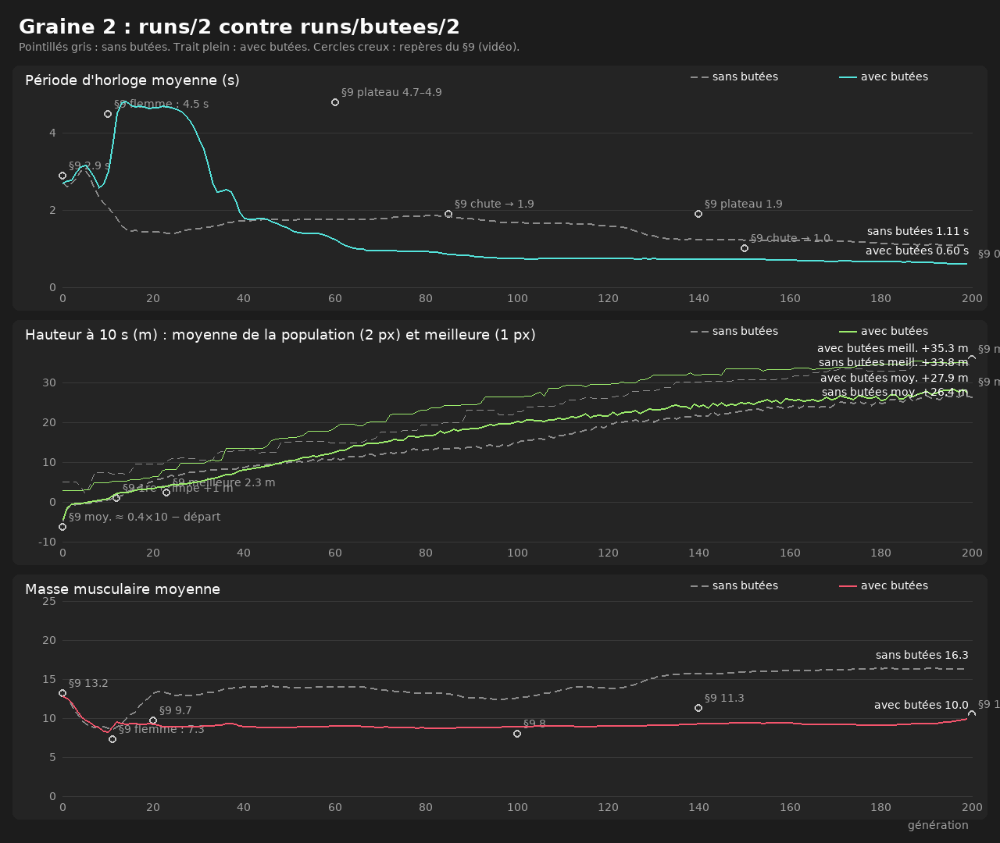

# Chantier B, phase B2 : butées articulaires dans le moteur

B1 (docs/chantier_b_diagnostic.md) a montré que les trois graines entraînées sans butées dépassaient largement les
bornes anatomiques. B2 applique ces butées dans le moteur, resserre les cibles du génome sur la plage articulaire,
réentraîne les graines 0, 1 et 2, et compare avant de refaire le moindre écran. **Aucun écran n'a été refait.**

## 1. Ce qui a changé dans le moteur

- **Contrainte à sens unique** sur l'angle de chacune des 8 articulations musclées, bornes de `JOINT_LIMITS_DEG`
  (épaule [−60°, +90°], coude [0°, 140°], hanche [−80°, +75°], genou [0°, 140°]). Même famille que les liens et le
  contact au sol, dans les mêmes passes de Gauss-Seidel :
  - impulsion de la forme de `Contract()` (perpendiculaire sur les deux os, opposée sur le pivot : forces et
    moments de somme nulle), impulsion cumulée ≥ 0 ;
  - schéma du contact au sol, validé : terme spéculatif `−C/h` (la butée peut être atteinte pile dans le sous-pas,
    pas dépassée), biais de Baumgarte `−BETA·C/h` avec `BETA = 0`, correction de pénétration par la projection de
    position seule. Pas de biais propre aux butées : c'est le mélange biais + projection qui avait créé de
    l'énergie en phase 3 ;
  - la borne visée est la plus proche sur le cercle : un angle très hors bornes repart par le côté court.
- **Trois implémentations, mêmes opérations dans le même ordre** : noyau numba scalaire, référence Python,
  évaluateur batché, via trois petites fonctions partagées. Scalaire et batché sont identiques au bit près avec
  les butées engagées (test `assert_array_equal`).
- **Drapeau `JOINT_LIMITS`** (True) ; absent de la config d'un run = False. Les runs 0, 1 et 2 se rejouent à
  l'identique (champions des générations 0, 100 et 200 des trois graines), et la vue population de la graine 2
  est identique au pixel près à celle de la phase 5b.
- **Cibles du génome** tirées et mutées dans la plage articulaire (σ = 5 % de la plage de chaque articulation).
- **Coût** : évaluation de 1000 créatures × 10 s en 7,7–8,4 s contre 5,5–5,8 s (+45 %), après avoir restreint la
  projection aux butées à moins de la marge (le recalcul à chaque passe doublait le temps).

## 2. Réentraînement : hauteurs et scores

`train --seed S --generations 200 --pop 1000 --run-dir runs/butees/S --set AUDIT_EVERY=10`. Les runs sont dans
`runs/butees/` (ignoré par git, comme les runs actuels).

| Champion gén. 200 | sans butées | avec butées | vidéo (§9) |
|---|---|---|---|
| graine 0 | +16,7 m · score +11,9 | **+34,2 m** · score +28,3 | 36 m |
| graine 1 | +37,3 m · score +31,0 | +33,4 m · score +26,8 | |
| graine 2 (référence) | +33,8 m · score +26,3 | **+35,3 m** · score +30,8 | |

| Gén. 200 | graine 0 (sans / avec) | graine 1 | graine 2 | vidéo |
|---|---|---|---|---|
| hauteur moyenne | +12,8 / +26,6 m | +27,7 / +25,2 m | +26,4 / +27,9 m | ≈ +27,7 m |
| au sol | 9 / 61 | 98 / 121 | 88 / 51 | ≈ 30 |
| période moyenne | 1,02 / 1,54 s | 2,02 / 0,88 s | 1,11 / **0,60 s** | 0,6 s |
| masse musculaire moyenne | 11,2 / 14,6 | 13,2 / 16,7 | 16,3 / **10,0** | 10,5 |
| énergie du champion | 9,3 / 11,3 | 12,3 / 12,3 | 15,0 / 8,8 | 32,5 |

**Verdict hauteurs : pas d'écart important, les constantes de la phase 3 se transfèrent.** Les trois champions
sont entre 33 et 35 m (36 m dans la vidéo) ; la graine 0, qui plafonnait à 16,7 m, rejoint les autres ; la moyenne
de la population est à 2,5 m près celle de la vidéo. Deux écarts restent : plus de créatures au sol à la génération 200 (51 à
121 contre ≈ 30), et une masse musculaire au-dessus de la vidéo pour les graines 0 et 1 (14,6 et 16,7 contre 10,5).
L'énergie du champion reste loin des 32,5 de la vidéo, comme avant B2 (écart connu, lié à la définition de E).

Repères du §9 (phase flemmarde, chutes de période) :

| | graine 0 (sans / avec) | graine 1 | graine 2 | vidéo |
|---|---|---|---|---|
| période max, gén. 1–80 | 3,36 / **4,01 s** | 3,21 / 3,46 s | 3,04 / **4,83 s** | 4,5 puis 4,7–4,9 s |
| creux de muscle, gén. 1–20 | 8,9 / 9,1 | 7,6 / 7,6 | 8,6 / 8,2 | 7,3 (gén. 11) |
| plus forte baisse de période (15 gén.) | −1,97 s (gén. 8 → 23) / −1,79 s (33 → 48) | −1,12 / −2,56 s (11 → 26) | −1,59 / −2,86 s (25 → 40) | 4,6 → 1,9 s (gén. 80–85) |

Avec butées, la phase flemmarde réapparaît nettement pour les graines 0 et 2 (période à 4,0 et 4,8 s, plateau de
15 à 25 générations), puis une chute brutale, plus tôt que dans la vidéo (génération 35–40 contre 80–85). La
graine 2 finit comme la vidéo : période 0,60 s, masse musculaire ≈ 9 puis 10,0.

Courbes superposées (`graphs --run-dir runs/butees/S --compare runs/S`), pointillés gris = sans butées :

## 3. Angles avant / après (`joints`)

Part du temps au-delà des butées (de plus de 1e-6°), 50 meilleures de la génération 200 :

| | épaule | coude | hanche | genou |
|---|---|---|---|---|
| graine 0 sans / avec | 70 % / 0 % | 11 % / 0 % | 48 % / 0 % | 0 % / 0 % |
| graine 1 sans / avec | 4 % / 0 % | 15 % / 0 % | 60 % (hélice) / 0 % | 45 % / 0 % |
| graine 2 sans / avec | 0 % / 0 % | 1 % / 0 % | 74 % / 0 % | 0 % / 0 % |

- **Pénétration maximale** : 0,000° sur les 150 meilleures de la génération 200 ; 0,39° au plus sur 150 créatures
  au hasard de la génération 0 (hanche, graine 2), sous le critère de 0,5°. Plus aucun tour complet.
- **Cibles du génome** : 0 % hors butées. Beaucoup sont posées sur une butée par les mutations (graine 1 : 26 %
  des cibles d'épaule, 28 % de coude, 27 % de genou ; graine 2 : 53 % des cibles de genou) : l'évolution pousse
  contre les butées, et le contrôleur pousse alors l'articulation contre sa butée.
- **Champions de la génération 200** (min..max) : graine 2 épaule −60..+45°, coude +35..+104°, hanche −80..−41°,
  genou +19..+115°. Les fémurs restent portés vers l'arrière, mais s'arrêtent à la butée de −80° au lieu de −125° ;
  la vidéo les porte vers l'avant (−26 à +70°).

**Point ouvert : les pieds peuvent encore croiser l'axe du corps.** Fémur rabattu à la butée (−80°) et genou
fléchi (jusqu'à 112°) amènent le pied sous la queue : champion de la graine 1, pieds de l'autre côté de l'axe 90 %
du temps et jambes croisées 57 % du temps ; graine 2, pieds 43 %, croisements ≈ 0 %. Aucune butée d'une seule
articulation ne l'empêche : il faudrait une contrainte couplée hanche–genou, ou une collision entre segments.

## 4. Énergie au moment où une butée s'engage

L'audit (`evo/audit.py`) classe chaque sous-pas : une butée y entre dans le solveur (engagement), des butées y
restent actives (contact), aucune butée (libre). « Saut » = énergie créée hors muscles dans le sous-pas (bilan du
sous-pas moins l'apport des muscles, s'il est positif). Valeurs réelles, maximum sur les 10 meilleures de chaque
génération auditée (`joints --energy`) :

| graine | gén. | engagements par grimpe | saut à l'engagement | contact | libre | créé hors muscles sur 10 s | hausse d'énergie potentielle due à la projection, à l'engagement |
|---|---|---|---|---|---|---|---|
| 0 | 0 | 16 | 0 J | 0 J | 0 J | 0 J | 0,044 J (0,19 mm) |
| 0 | 50 | 11 | 0 J | 0 J | 0 J | 0 J | 0,015 J (0,07 mm) |
| 0 | 100 | 16 | 0 J | 0 J | 0 J | 0 J | 0,031 J (0,13 mm) |
| 0 | 150 | 22 | 0 J | 0 J | 0 J | 0 J | 0,007 J (0,03 mm) |
| 0 | 200 | 22 | 0 J | 0 J | 0 J | 0 J | 0,023 J (0,14 mm) |
| 1 | 0 | 12 | 0 J | 0 J | 0 J | 0 J | 0,038 J (0,16 mm) |
| 1 | 50 | 17 | 0 J | 0 J | 0 J | 0 J | 0,001 J (< 0,01 mm) |
| 1 | 100 | 24 | 0 J | 0 J | 0 J | 0 J | 0,002 J (0,01 mm) |
| 1 | 150 | 35 | 0 J | 0 J | 0 J | 0 J | 0,008 J (0,04 mm) |
| 1 | 200 | 34 | 0 J | 0 J | 0 J | 0 J | 0,010 J (0,05 mm) |
| 2 | 0 | 9 | 0 J | 0 J | 0 J | 0 J | 0,079 J (0,35 mm) |
| 2 | 50 | 34 | 0 J | 0 J | 0 J | 0 J | 0,001 J (< 0,01 mm) |
| 2 | 100 | 50 | 0 J | 0 J | 0 J | 0 J | < 0,001 J |
| 2 | 150 | 53 | 0 J | 0 J | 0 J | 0 J | < 0,001 J |
| 2 | 200 | 66 | 0 J | 0 J | 0 J | 0 J | 0,004 J (0,02 mm) |

- **Aucun saut** : dans aucun des 150 × 4 800 sous-pas audités, l'énergie n'a augmenté au-delà de l'apport des
  muscles, ni à l'engagement, ni au contact, ni ailleurs. Les 51 audits de champion faits pendant les
  réentraînements (générations 0, 10, …, 200 ; toutes les 25 pour la graine 0, voir §6) donnent aussi 0 J.
- **Marge** : le seul effet positif mesurable est la hausse brute d'énergie potentielle que la projection donne en
  ramenant une articulation sur sa butée, au plus 0,079 J, soit 0,35 mm en équivalent hauteur, 14 fois sous le
  seuil d'alerte `AUDIT_MAX_LIMIT_JUMP` (5 mm par sous-pas), et toujours compensée dans le même sous-pas par la
  dissipation de la passe de vitesse (bilan net ≤ 0). La hausse d'énergie cinétique de l'étape liens + butées +
  sol à l'engagement vaut 0 J partout : l'arrêt est inélastique.
- Sur 10 s, la projection seule remonte plus d'énergie potentielle avec butées que sans (génome aléatoire de
  graine 3 : +139 J contre +5 J), mais moins que ce que la passe de vitesse dissipe dans les mêmes sous-pas.

## 5. Limite connue : longueur des os dans une posture coincée (ordre de projection conservé)

**Le cas.** Un audit de champion sur 51 a signalé une erreur de longueur des os de 1,97 % (critère du §1.4 :
< 1 %) : champion de la génération 20 de la graine 2, à t = 4,4 s, main gauche et deux pieds tenus, les deux
hanches et le coude droit en butée. Tout le torse est déformé (tête +1,97 %, demi-bassins −1,9 et −1,2 %, colonne
−1,1 %), au-dessus de 1 % pendant 0,9 s (443 sous-pas), puis l'erreur retombe. Le système est sur-contraint (trois
prises + trois butées) : dans chaque passe de projection, les butées passent après les liens et l'erreur qui ne
peut pas être résorbée reste sur les os. **Aucune énergie n'est créée** (0 J hors muscles sur la grimpe).

**Sa fréquence.** Sur les 10 meilleures des générations 0, 20, 50, 100 et 200 de la graine 2, seule cette créature
dépasse 1 % (les autres : 0,44 % au plus) ; audits des champions des graines 0 et 1 : 0,46 % au plus ; sans
butées : 0,27 % au plus.

**Variantes testées** sans réentraîner, sur 12 créatures (celle-ci, les 3 suivantes de sa génération, et les
4 meilleures des générations 80 de la graine 1 et 200 de la graine 2) :

| projection | erreur des os max | pénétration max | énergie créée |
|---|---|---|---|
| **actuelle, conservée** (liens, butées, sol) | 1,97 % | 0,002° | 0 J |
| butées d'abord (butées, liens, sol) | 0,93 % | 1,0° | 0 J |
| actuelle, 24 passes au lieu de 12 | 1,27 % | 0,000° | 0 J |

**Décision (validée).** L'ordre actuel est conservé, sans réentraînement : passer aux butées d'abord multiplierait
la pénétration par 500 (0,002° → 1,0°, au-delà du critère de 0,5°) pour corriger un défaut rare, bref et sans
conséquence énergétique ; 24 passes ne suffisent pas non plus (1,27 %) et coûtent du temps de calcul.

**Surveillance.** L'audit de chaque champion (`audit.csv`, toutes les AUDIT_EVERY générations) garde son alerte
« erreur de longueur des os » au-delà de 1 % : si ce cas devenait fréquent dans un futur run, il s'y verrait.

## 6. Autres constats

- `--set AUDIT_EVERY=10` était enregistré dans la config du run, mais `train()` lisait la cadence avant d'appliquer
  les surcharges : corrigé (test ajouté). La graine 0, lancée avant la correction, a été auditée toutes les 25
  générations ; ses générations 0, 50, 100, 150 et 200 sont couvertes par `joints --energy`.
- `joints` compte « au-delà » à plus de 1e-6° : sans cette tolérance, une cible posée sur la butée par une mutation
  (−60,000000000000014°) comptait comme hors bornes.

## 7. Écrans refaits sur runs/butees/2

Mêmes commandes et mêmes jeux d'images que les phases 4 à 6 et le chantier A, avec `--run-dir runs/butees/2`
(sorties dans `out/chantierB/ecrans/`, hors git) : `replay --gen 200 --export`, `population --gen 200 --export`,
`population --gen 0 --cycle --export`, `histogram --gen 0 / 1 / 200 --style video`, `analyze --gen 200 --export`,
`compare --export`, et les 6 vidéos (replay, créature 1 de la génération 0 ×4 avec carton, analyse au ralenti,
comparaison, population, cycle). Aucune alerte : toutes les hauteurs rejouées ou réévaluées sont celles du run.
Aucun réglage d'écran n'a été modifié.

| Écran | Ce qu'on voit | Référence |
|---|---|---|
| Replay | champion +35,3 m ; HUD période 0,6 s, muscle 10,2, énergie 8,8 ; 21,8 m à t = 6,4 s | image 09 : 0,6 s, 13,5, 32,5 ; 23,1 m |
| Replay, génération 0 | créature 1 : −6,1 m à t = 6,5 s, sur le tronc | image 03 : −4,9 m |
| Vue population | génération 200 triée ; 51 au sol, 62 % entre 30 et 35 m | §9 : ≈ 30 au sol, majorité entre 30 et 35 m |
| Histogramme | génération 200 : pic à 34–35 m, la barre de 34 m (537) dépasse la graduation maximale de 500 et est dessinée tronquée ; générations 0 et 1 : un groupe au sol, puis un pic autour de 0 qui grossit | images 26 à 28 |
| Cycle de la population | génération 0 → 1, comparable au chantier A (mêmes longueurs d'os tirées, poses un peu différentes) | image 25 |
| Analyse | forces : deltoïde 0 %, grand dorsal 40 %, biceps 24 %, fléchisseurs de hanche 0 %, fessiers 42 %, quadriceps 100 % | §9 : 22 %, 76 %, 57 %, 31 % |
| Comparaison de générations | 4 champions (générations 0, 23, 100, 200 : +3,0 à +35,3 m à 10 s), tous à l'écran de 0,5 à 10 s, 15,3 px/m | image 37 |

- **Temps de rendu** : plus élevés que lors des phases 5 et 6, mais c'est la machine : rechronométré dans les mêmes
  conditions, l'ancien champion prend 14,7 ms par image en analyse (10,5 ms en phase 5c) et le nouveau 12,9 ms. Le
  replay reste à 6,3 ms (0 % au-delà de 16,7 ms).
- **Nouveau constat : une morphologie trapue.** Toute la population de la graine 2 avec butées a une colonne à
  0,62 fois la référence (borne basse 0,6), un fémur à 0,60 (borne basse) et un demi-bassin à 1,36 (borne haute
  1,4) ; l'ancien champion avait une colonne à 0,89. Le lézard est plus court et plus large, sa queue (1,2 × la
  colonne) aussi, et il replie ses pattes contre le corps : les miniatures de la vue population sont compactes, et
  en analyse la queue disparaît derrière les pieds, qui se croisent sous le bassin (le point ouvert du §3). La
  vidéo montre un lézard allongé.

**Écarts connus révisés** (champion de la graine 2, génération 200) :
- période finale trop longue : **résolu** (0,58 s ; vidéo : 0,6 s) ;
- forces au plafond : **plus au plafond**, mais réparties autrement que dans la vidéo (deltoïde et fléchisseurs de
  hanche à 0 %, quadriceps à 100 %) ;
- pas de marche diagonale : **partielle** (une pose sur quatre en diagonale, main G + pied D) ;
- génération 0 trop bonne : inchangé (meilleure +3,0 m ; vidéo : la meilleure ne grimpe pas) ;
- créatures au sol à la génération 200 : 51 (vidéo ≈ 30 ; avant B2 : 88) ;
- énergie du champion : 8,8 (vidéo 32,5), inchangé ;
- **nouveau** : morphologie trapue, pieds croisés sous le bassin.

## 8. Pour la suite

- Ramener le chantier B sur `claude/modest-ritchie-mkwjnd`, et choisir alors le run de référence par défaut : les
  commandes lisent `runs/<graine>`, c'est-à-dire les anciens runs sans butées ; les nouveaux sont dans
  `runs/butees/<graine>` (hors git, dans ce conteneur).
- Points à discuter : la morphologie trapue (longueurs collées aux bornes de `LENGTH_FACTOR_RANGE`), les pieds qui
  croisent l'axe (§3), l'excès de créatures au sol, la masse musculaire des graines 0 et 1.
